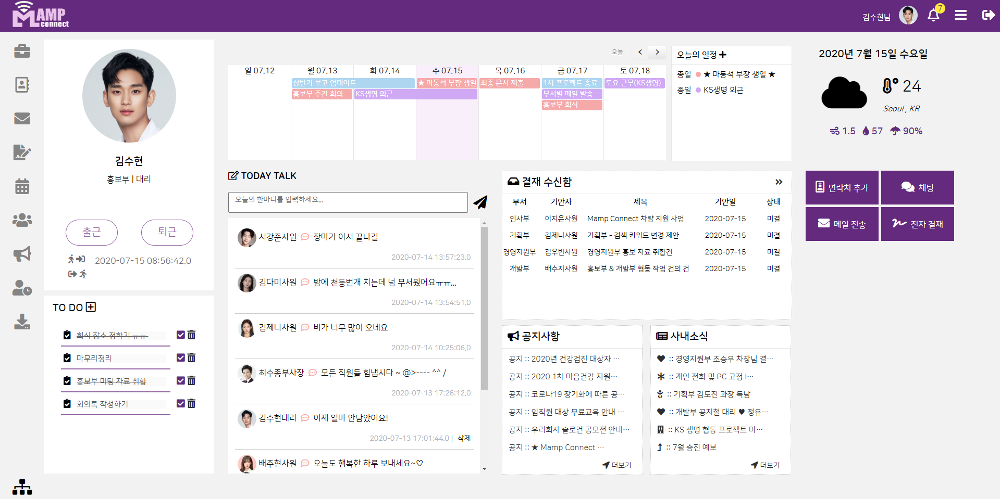
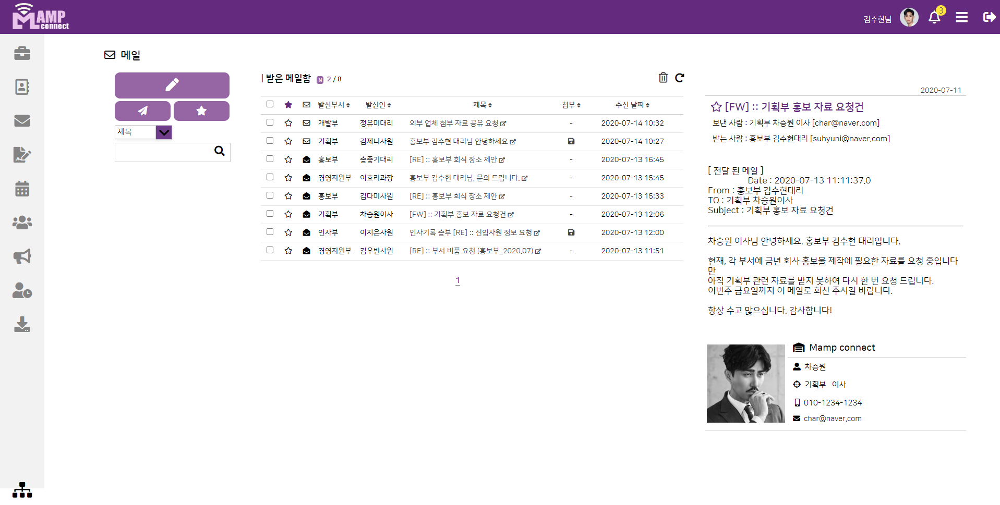

# Groupware
### 💻 2020 파이널 프로젝트 _ 그룹웨어 시스템 
 + 기업 내 사무전산 포탈인 그룹웨어 시스템 개발   
 + 현재의 기업 환경에 기본적으로 필요한 기능을 중심으로, 직관적이고 간편한 시스템 구현에 초점을 맞추었다.
 #
 + 특징 
 > + JAVA / JSP / Servlet / HTML5 / CSS3 
 > + Ajax / javascript / jQuery / JSON / XML
 > + Spring / Spring Security / maven / GIT 
 > + Oracle DB 
 #
 + 주요 기능 
> + 메인 화면 내 여러 기능 배치   
    - 개인 프로필 / TO DO 리스트 / 주간 일정 / 날씨 위젯 / 알림 등 
> + 사원 등록/ 정보 관리 (관리자 페이지) 
> + 공용 / 개인 주소록 
> + 전자 결재 / 사내 메일 시스템 
> + 근태 관리 / 일정 관리 / 조직도 
> + 커뮤니티 / 공지 / NEWS / 자료실 / 식단표 
> + 채팅 
 #
 
 
